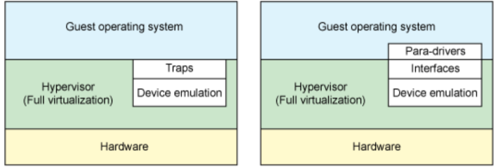
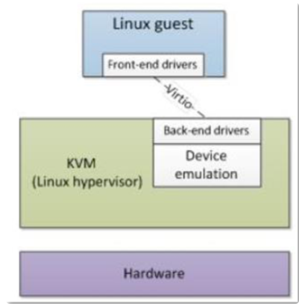

# VirtioForNewbies

## Introduction

My name is Yonathan Bettan and I work at RedHat in the virtualization KVM team.

This blog has 2 main purposes, the first is to give you an idea of what virtio is and why should we use it when the second is to serve as a step-by-step guide describing how to write a virtio device from scratch with some code examples.

In addition, I will write a SIMPLE virtio educational example and documented device that you will be able to find at [ybettan/qemu/virtio branch][ybettan/qemu/virtio branch] and its driver [ybettan/QemuDeviceDrivers-master branch][ybettan/QemuDeviceDrivers-master branch].

## Motivation

Let us start with a NIC (Network Interface Controller) as an example to understand better virtualization.
A NIC is responsible for transmitting and receiving packets through the network.
The received packets are written into memory and the packets to be sent are copied from the memory to the NIC for transmission with CPU intervention or without (DMA).
When the NIC finishes a specific task it sends an interrupt to the OS.

If we want a physical machine to have a network connection we will have to buy a NIC and with the same logic if we want a virtual machine (VM) to have a network connection we will need to supply a virtual NIC.

One possible solution is to make the hypervisor fully emulate the NIC according to its spec – **_Virtual device_**.

<p align="center">
  
</p>

When a package is sent on the guest OS it is sent to virtual NIC (vNIC). For each byte of data we will get:

A virtual interrupt will be generated ==> a VMexit will occur ==> the hypervisor will send the data to the physical NIC (pNIC) ==> the pNIC will interrupt the host OS when it finishes the transaction ==> the hypervisor will finally interrupt the guest OS to notify the transaction is finish.

We can see here a function of a NIC driver which its purpose is to read data from the device and write it into a buffer.

```c
void nic_write_buffer(char *buf, int size)
{
  for (; size > 0 ; size--) {
    nic_poll_ready();           // many traps
    outb(NIC_TX_BUF, *buf++);   // many traps
  }
}
```

NOTE: even if we use MMIO instead of PIO we still have a limitation on the MMIO write size and each MMIO write generates a VMexit so we still may have multiply VMexits.

The main benefits, in this case, is that the OS stays unchanged because the virtual device acts as a physical device so the already-written NIC driver does the job correctly on the emulated device.
From the other hand it works slowly since each access to the vNIC generate a VMexit for each byte (as pNIC would have done) but in the reality this is not a real device (only code variables) so we don’t need to VMexit on each byte, instead we can just write the whole buffer and generate a single VMexit.

Another possible solution is to give the guest direct access to the pNIC – **_Device assignment_**.

<p align="center">
  
</p>

When a package is sent on the guest OS it is sent to the vNIC, For each byte of data we will get:

The data is sent directly to the pNIC without the hypervisor intervention ==> the pNIC will interrupt the guest OS directly when it finishes the transaction.

Now we have max performance that the HW can supply but we need separate pNIC for each guest and another one to the host, this becomes expensive.

The tradeoff between **_Virtual devices_** and **_Device assignment_** is **_Paravirtual devices_** and its protocol – **_VirtIO_**.

<p align="center">
  
</p>

This case is quite similar to the Virtual device case except for 2 facts, the first is that the emulated device don’t pretend to act like a real device (no need to send virtual interrupts for each byte written but only a single virtual interrupt once the whole buffer is written) and the second is that we now have to write a new driver since the original driver no longer fits with the emulated HW.

We can now see the same function of a NIC  __new__ driver.

```c
void nic_write_buffer(char *buf, int size)
{
  for (; size > 0 ; size--) {
    vmm_write(NIC_TX_BUF, buf, size);   // one trap
  }
}
```

Another reason to use virtio devices is that Linux support multiple hypervisors such as KVM, Xen, VMWare etc.
Therefore we have drivers for each one of them.
virtio provides **_Driver-unification_**, a uniform ABI for all those hypervisors.
An ABI is an interface at the compiler level and describes how do parameters are passed to function (register\stack), how interrupts are propagated etc.
virtio also provides device check and configuration.

## Virtualization VS Paravirtualization

| Virtualization | Paravirtualization |
|:-------------:|:-------------:|
| The guest is unaware that it is being virtualized | The guest is aware that it is running on a hypervisor (and not on real HW) |
| No changes are requested on the OS | Requires modification of the OS |
| The hypervisor must emulate device HW, this will lead to low performance | The guest and the hypervisor can work cooperatively to make this emulation efficient |

<p align="center">
  
</p>

## VirtIO device

A virtio device is a paravirtualized device based on virtio communication protocol, as a PCI device is an emulated device based on PCI bus, therefore as we have seen it requires some drivers.

There are two kinds of drivers needed, the first is the guest OS driver, also called the “front-end driver”, and the second is the hypervisor driver, also called the “back-end driver”.
These two drivers are communicating via the virtio protocol that is based on virtual queues of buffers.

<p align="center">
  
</p>

As describe in the [virtio-spec][virtio-spec], there are three different ways of implementing the transport of a virtio device:

  * **Over PCI bus** – we will focus on this one
  * Over MMIO
  * Over channel I\O
  
Implementing a virtio device over a PCI bus can feel a bit nonsense at first since, as we said, a virtio device isn’t a real device so why are we trying to enforce it to act and communicate like one?!
The answer to that question is simply the fact that we already have an entire infrastructure and multiple functionalities for PCI devices, for example, the Linux command `lspci` to list all the PCI devices running on the machine (or the VM in our case), therefore implementing a virtio device over PCI bus let as use all those features without getting a real device performance penalty.

Implementing a virtio device over MMIO is usually used in virtual environments without PCI support (a common situation in embedded devices models).
The memory mapped virtio device behavior is based on the PCI device specification, Therefore most operations are nearly identical.

Implementing a virtio device over channel I\O is used on machines that support neither PCI nor MMIO, therefore a different transport is needed.
A virtual channel device act as a proxy to the virtio device (similar to the way virio-pci uses a PCI device) and operations of the virtio device is accomplished mostly via channel commands.
This means virtio devices are discoverable via standard OS algorithms.

## Steps to create a new virtio device

When creating a new device there are some steps we should follow:

1. write the device specification
    * merge it into the official virtio specification
      * `git clone git clone https://github.com/oasis-tcs/virtio-spec.git`
      * add your device
        * use [ybettan/virtio-spec/master branch][ybettan/virtio-spec/master branch] as reference
        * since the specification is written in LaTex, you will need it to write your own device specification
          * for Fedora users: `sudo dnf install texlive-scheme-full`
      * send your patch to virtio-comment@lists.oasis-open.org (mailing list) for review
    * for more information check [virtio-spec][virtio-spec]
   
2. write the device implementation
    * you can look at the example device at  [ybettan/qemu/virtio branch][ybettan/qemu/virtio branch] located in my fork of the Qemu project
    * make sure to follow the full commit to find all other files related
    * once it’s done, check the [wiki-qemu][wiki-qemu] for the full “how to contribute” to Qemu guide

3. write the Linux driver for this device
    * you can look at the example driver at  [ybettan/QemuDeviceDrivers-master branch][ybettan/QemuDeviceDrivers-master branch]
    * in this repository, you have a README.md files describing how to compile the driver and use the device
    * once it’s done, send the patch to this mailing list: virtualization@lists.linux-foundation.org
    
    
[virtio-spec]: http://docs.oasis-open.org/virtio/virtio/v1.0/virtio-v1.0.html
[ybettan/virtio-spec/master branch]: https://github.com/ybettan/virtio-spec
[ybettan/qemu/virtio branch]: https://github.com/ybettan/qemu/tree/virtio/hw/virtio
[ybettan/QemuDeviceDrivers-master branch]: https://github.com/ybettan/QemuDeviceDrivers
[wiki-qemu]: https://wiki.qemu.org/Contribute
