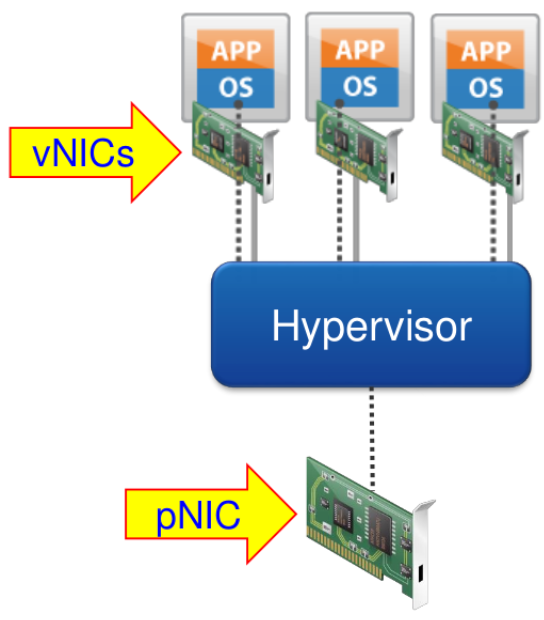
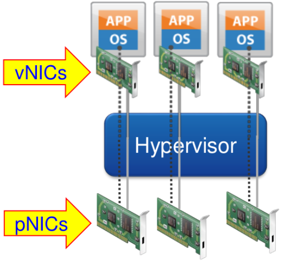
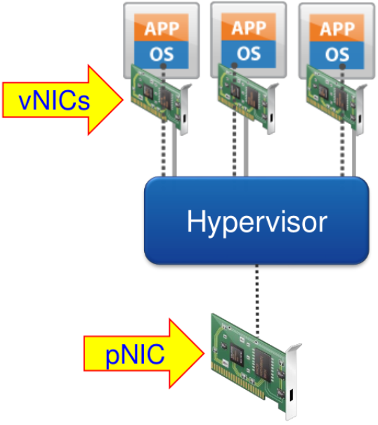

# VirtioForNewbies

## Introduction

My name is Yonathan Bettan and I work at RedHat in the virtualization KVM team.

This blog has 2 main purposes, the first is to give you an idea of what virtio is and why should we use it when the second is to serve as a step-by-step guide describing how to write a virtio device from scratch with some code examples.

In addition, I will write a SIMPLE virtio educational example and documented device that you will be able to find in my [fork](https://github.com/ybettan/qemu/tree/virtio/hw/virtio) of the Qemu project at  and its driver [here](https://github.com/ybettan/QemuDeviceDrivers/tree/master/virtio).

## Motivation

Let us start with a NIC (Network Interface Controller) as an example to understand better virtualization.
A NIC is responsible for transmitting and receiving packets through the network.
The received packets are written into memory and the packets to be sent are copied from the memory to the NIC for transmission with CPU intervention or without (DMA).
When the NIC finishes a specific task it sends an interrupt to the OS.

If we want a physical machine to have a network connection we will have to buy a NIC and with the same logic if we want a virtual machine (VM) to have a network connection we will need to supply a virtual NIC.

One possible solution is to make the hypervisor fully emulate the NIC according to its spec – **_Virtual device_**.

<p align="center">
  
</p>

When a package is sent on the guest OS it is sent to virtual NIC (vNIC). For each byte of data we will get:

A virtual interrupt will be generated ==> a VMexit will occur ==> the hypervisor will send the data to the physical NIC (pNIC) ==> the pNIC will interrupt the host OS when it finishes the transaction ==> the hypervisor will finally interrupt the guest OS to notify the transaction is finish.

We can see here a function of a NIC driver which its purpose is to read data from the device and write it into a buffer.

```c
void nic_write_buffer(char *buf, int size)
{
  for (; size > 0 ; size--) {
    nic_poll_ready();           // many traps
    outb(NIC_TX_BUF, *buf++);   // many traps
  }
}
```

NOTE: even if we use MMIO instead of PIO we still have a limitation on the MMIO write size and each MMIO write generates a VMexit so we still may have multiply VMexits.

The main benefits, in this case, is that the OS stays unchanged because the virtual device acts as a physical device so the already-written NIC driver does the job correctly on the emulated device.
From the other hand it works slowly since each access to the vNIC generate a VMexit for each byte (as pNIC would have done) but in the reality this is not a real device (only code variables) so we don’t need to VMexit on each byte, instead we can just write the whole buffer and generate a single VMexit.

Another possible solution is to give the guest direct access to the pNIC – **_Device assignment_**.

<p align="center">
  
</p>

When a package is sent on the guest OS it is sent to the vNIC, For each byte of data we will get:

The data is sent directly to the pNIC without the hypervisor intervention ==> the pNIC will interrupt the guest OS directly when it finishes the transaction.

Now we have max performance that the HW can supply but we need separate pNIC for each guest and another one to the host, this becomes expensive.

The tradeoff between **_Virtual devices_** and **_Device assignment_** is **_Paravirtual devices_** and its protocol – **_VirtIO_**.

<p align="center">
  
</p>

This case is quite similar to the Virtual device case except for 2 facts, the first is that the emulated device don’t pretend to act like a real device (no need to send virtual interrupts for each byte written but only a single virtual interrupt once the whole buffer is written) and the second is that we now have to write a new driver since the original driver no longer fits with the emulated HW.

We can now see the same function of a NIC  __new__ driver.

```c
void nic_write_buffer(char *buf, int size)
{
  for (; size > 0 ; size--) {
    vmm_write(NIC_TX_BUF, buf, size);   // one trap
  }
}
```

Another reason to use virtio devices is that Linux support multiple hypervisors such as KVM, Xen, VMWare etc.
Therefore we have drivers for each one of them.
virtio provides **_Driver-unification_**, a uniform ABI for all those hypervisors.
An ABI is an interface at the compiler level and describes how do parameters are passed to function (register\stack), how interrupts are propagated etc.
virtio also provides device check and configuration.
